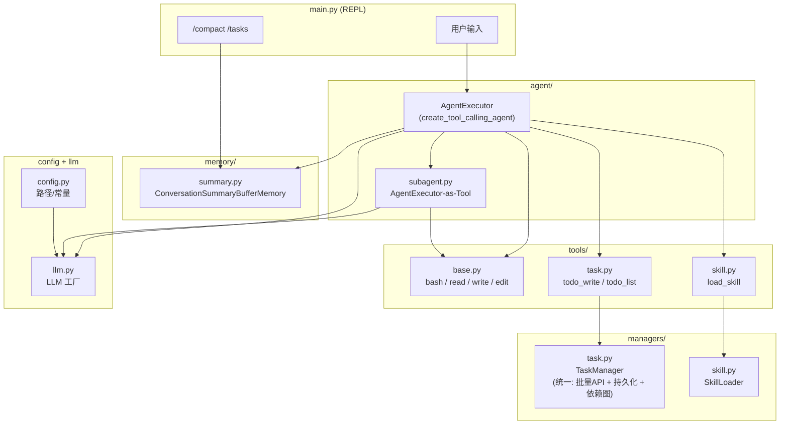

# LangChain 重构 my-mini-cc

## 目标架构




## 目录结构

```
my-mini-cc/
├── core.py                 # MiniCC 类 — 唯一编程 API（Facade），组装所有组件
├── main.py                 # REPL 入口（瘦包装，~30 行，调用 MiniCC）
├── config.py               # Settings 类（Pydantic Settings）— 所有配置的唯一来源
├── llm.py                  # create_llm() 工厂：env 读取 LLM_PROVIDER 分发到 ChatOpenAI / ChatAnthropic / ChatZhipuAI
├── agent/
│   ├── __init__.py
│   ├── executor.py         # build_agent_executor(): prompt 模板 + 工具注册 + AgentExecutor
│   └── subagent.py         # Worker 调度（WORKER_TYPES 配置 + 代理 tool）
├── tools/
│   ├── __init__.py         # get_all_tools() 聚合函数
│   ├── base.py             # @tool bash / read_file / write_file / edit_file（含 safe_path）
│   ├── task.py             # @tool todo_write / todo_list（调用统一 TaskManager）
│   └── skill.py            # @tool load_skill + run_skill_tool（代理工具模式）
├── managers/
│   ├── __init__.py
│   ├── task.py             # TaskManager（合并版：批量 API + 持久化 + 依赖图 + nag 支持）
│   └── skill.py            # SkillLoader（重写：manifest.json 发现 + 渐进式披露 + 脚本执行）
├── memory/
│   ├── __init__.py
│   └── summary.py          # AgentMemory（三层压缩 + 上下文压力感知）
└── requirements.txt        # langchain, langchain-openai, langchain-anthropic, langchain-community, pydantic-settings
```

## 核心映射关系

### 0. core.py — MiniCC 类（Facade / 编程 API）

所有接入方式（CLI / MCP / 子 agent / Web API）的唯一入口：

```python
class MiniCC:
    def __init__(self, workdir=None, llm_provider=None, model_id=None, ...):
        """组装所有内部组件"""

    def chat(self, message: str) -> AgentResult:
        """单轮对话，返回结构化结果（output, tools_used, token_usage）"""

    def stream(self, message: str):
        """流式输出"""

    @classmethod
    def quick_run(cls, prompt: str, workdir: str, **kwargs) -> str:
        """无状态单次调用（适合 MCP / 子 agent 场景）"""

    def compact(self):
        """手动压缩记忆"""

    def reset(self):
        """清空记忆"""

    @property
    def tasks(self) -> TaskManager: ...

    @property
    def skills(self) -> SkillLoader: ...

    @property
    def memory(self) -> AgentMemory: ...
```

接入层示例：

- **REPL**: `main.py` 调用 `agent.chat(query)`
- **MCP**: `mcp_server.py` 包装 `agent.chat()` 为 MCP tool
- **子 agent**: 其他系统 `MiniCC.quick_run(prompt, workdir)`

### 1. config.py — 统一配置中心（Pydantic Settings）

所有可配置项集中在一个 `Settings` 类中，支持 `.env` 文件覆盖：

```python
class Settings(BaseSettings):
    # --- LLM ---
    llm_provider: str = "openai"          # openai | anthropic | zhipu
    model_id: str = "gpt-4o"
    api_base_url: str | None = None       # 自定义 API 端点

    # --- Paths ---
    workdir: Path = Path.cwd()
    tasks_dir: str = ".tasks"             # 相对于 workdir
    skills_dir: str = "skills"
    transcript_dir: str = ".transcripts"

    # --- Memory ---
    soft_token_limit: int = 40000
    hard_token_limit: int = 80000

    # --- Agent ---
    max_iterations: int = 30

    # --- Workers ---
    worker_explore_max_iter: int = 15
    worker_coder_max_iter: int = 30
    worker_shell_max_iter: int = 10

    # --- Safety ---
    dangerous_commands: list[str] = ["rm -rf /", "sudo", "shutdown", "reboot", "> /dev/"]
    command_timeout: int = 120

    model_config = {"env_file": ".env", "extra": "ignore"}
```

所有模块统一 `from config import settings` 获取配置，不再各自读 env。

### 2. llm.py — LLM 工厂

- 从 `settings.llm_provider` 分发：
  - `openai` / 自定义兼容 API → `ChatOpenAI(model=settings.model_id, base_url=settings.api_base_url)`
  - `anthropic` → `ChatAnthropic(model=settings.model_id)`
  - `zhipu` → `ChatZhipuAI(model=settings.model_id)` (langchain-community)
- 统一返回 `BaseChatModel`
- API Key 通过标准环境变量（OPENAI_API_KEY / ANTHROPIC_API_KEY）传入，由 LangChain 自动读取

### 3. managers/task.py — 统一 TaskManager（核心变更）

合并原 TodoManager (s03) 与 TaskManager (s07)，设计原则：

- **对 LLM 的接口**：只暴露 `todo_write(items)` 和 `todo_list()` 两个 tool，认知负担最小
- **内部能力**：持久化 + blockedBy/blocks 依赖图 + 自动解阻塞

```python
class TaskManager:
    def update(self, items: list[dict]) -> str:
        """批量写入/更新任务。每个 item:
        - id: str (可选，不传则自动生成)
        - content: str (必填)
        - status: pending | in_progress | completed (必填)
        - blocked_by: list[str] (可选，其他 item 的 id)
        校验规则：最多 20 条，至多 1 个 in_progress。
        完成时自动解阻塞下游任务。持久化到 .tasks/ 目录。"""

    def list_all(self) -> str:
        """渲染当前全部任务，含状态标记和阻塞关系"""

    def has_open_items(self) -> bool:
        """给 prompt 动态注入用：是否有未完成任务"""

    def render_for_prompt(self) -> str:
        """简洁渲染，供 system prompt 动态嵌入"""
```

### 4. managers/skill.py — SkillLoader（重写：插件式技能系统）

技能目录约定：

```
skills/
├── database/
│   ├── manifest.json       # 元数据 + 工具声明（启动时读取摘要）
│   ├── SKILL.md            # 完整说明（load 后才可见）
│   └── tools/
│       ├── run_migration.py
│       └── check_schema.py
└── docker/
    ├── manifest.json
    ├── SKILL.md
    └── tools/
        └── compose_up.sh
```

manifest.json 格式：

```json
{
  "name": "database",
  "description": "SQL schema 设计与数据库迁移工具",
  "tools": [
    {
      "name": "run_migration",
      "description": "执行 SQL 迁移文件",
      "script": "tools/run_migration.py",
      "args": {
        "file": {"type": "string", "description": "迁移文件路径", "required": true}
      }
    }
  ]
}
```

SkillLoader 核心设计：

```python
class SkillLoader:
    def __init__(self, skills_dir: Path):
        self.skills_dir = skills_dir
        self.registry = {}      # name -> manifest (启动时扫描)
        self.loaded = {}        # name -> {manifest, body, tools_dir}（已加载的）
        self._scan()

    def _scan(self):
        """启动时扫描所有 manifest.json，只读 name + description"""

    def summaries(self) -> str:
        """返回所有技能的摘要列表（注入 system prompt）"""

    def load(self, name: str) -> str:
        """加载技能：读取完整 SKILL.md + 工具清单，标记为已加载"""

    def run_tool(self, skill_name: str, tool_name: str, args: dict) -> str:
        """执行已加载技能的工具脚本（subprocess 调度）
        - Python 脚本：python script.py --args-json '{...}'
        - Shell 脚本：bash script.sh args...
        未加载的技能返回错误提示"""
```

渐进式披露流程：

- 启动时：`summaries()` → system prompt 只含 "database: SQL设计与迁移"
- Agent 调用 `load_skill("database")` → 返回完整 SKILL.md + 工具名/参数描述
- Agent 调用 `run_skill_tool("database", "run_migration", '{"file":"001.sql"}')` → 执行脚本

### 5. tools/ — LangChain @tool 包装

- `base.py`: 用 `@tool` 包装 bash / read_file / write_file / edit_file（含 safe_path 安全检查）
- `task.py`: 用 `StructuredTool` 包装为 `todo_write`（入参是 items list）和 `@tool todo_list`
- `skill.py`: 两个固定 tool:
  - `@tool load_skill(name: str)` — 加载技能，返回完整说明 + 工具列表
  - `@tool run_skill_tool(skill_name: str, tool_name: str, args: str)` — 执行已加载技能的工具（args 为 JSON 字符串）
- `__init__.py`: `get_all_tools()` 汇总所有 tool 列表

### 6. agent/executor.py — 主 Agent

- `ChatPromptTemplate` 包含:
  - system prompt（skills 描述 + **TaskManager.render_for_prompt() 动态注入当前任务状态**）
  - `MessagesPlaceholder("chat_history")`（memory 自动填充）
  - human input
  - agent_scratchpad
- `create_tool_calling_agent(llm, tools, prompt)` 创建 agent
- `AgentExecutor(agent, tools, memory, verbose=True, max_iterations=30, handle_parsing_errors=True)`

### 7. agent/subagent.py — Worker 调度系统（中心辐射 + 禁止递归）

预定义 Worker 类型配置：

```python
WORKER_TYPES = {
    "explore": {
        "description": "快速只读探索：搜索代码、理解结构、回答问题",
        "tools": ["bash", "read_file"],
        "max_iterations": 15,
        "system_hint": "你是一个代码探索者。只读不写，快速搜索并总结发现。",
    },
    "coder": {
        "description": "代码修改：可读写文件，执行独立的编码任务",
        "tools": ["bash", "read_file", "write_file", "edit_file"],
        "max_iterations": 30,
        "system_hint": "你是一个编码者。按照指示精确完成编码任务，完成后总结改动。",
    },
    "shell": {
        "description": "命令执行：专注于运行 shell 命令和分析输出",
        "tools": ["bash"],
        "max_iterations": 10,
        "system_hint": "你是一个命令执行专家。运行命令并分析结果。",
    },
}
```

Tool 定义（强化描述以引导主 agent 决策）：

```python
@tool
def subagent(prompt: str, worker_type: str = "explore") -> str:
    """派生一个专门的 Worker 智能体执行独立任务并返回结果。
    Worker 是临时的：没有记忆，跑完即销毁。
    Worker 看不到你的对话历史，prompt 必须自包含。
    worker_type: "explore" | "coder" | "shell"
    ⚠ 简单任务请自己做，不要滥用 subagent。"""
```

主 agent system prompt 中注入调度规则：

```
## 子智能体调度规则
何时派生 Worker：
- 需要大范围搜索/探索代码库 → worker_type="explore"
- 需要隔离的编码任务（不影响当前上下文）→ worker_type="coder"
- 需要运行多个命令并分析输出 → worker_type="shell"
何时自己做（不要派生）：
- 读一个已知路径的文件 → 直接 read_file
- 做一处简单的编辑 → 直接 edit_file
- 跑一条简单的命令 → 直接 bash
```

设计要点：

- Worker 不能再派生子 agent（工具表不含 subagent），禁止递归
- 通过 WORKER_TYPES 配置字典管理类型，方便后续扩展
- 每次调用创建独立 AgentExecutor（无 memory），跑完即销毁

### 8. memory/summary.py — 三层压缩 AgentMemory（继承 BaseMemory）

融合原始代码的两层压缩 + ConversationSummaryBufferMemory 的渐进式摘要，形成三层架构：


| 层级                 | 来源                              | 触发条件                          | LLM 开销                  |
| ------------------ | ------------------------------- | ----------------------------- | ----------------------- |
| 第 1 层 microcompact | 原始代码                            | 每轮                            | 零                       |
| 第 2 层 渐进式摘要        | ConversationSummaryBufferMemory | token > soft_limit            | 低（只摘要最老几条）              |
| 第 3 层 硬压缩          | 原始 auto_compact                 | token > hard_limit 或 /compact | 高（全量摘要 + transcript 落盘） |


阈值设计（偏保守，减少模型认知负担）：

```python
soft_token_limit: int = 40000    # 开始渐进式摘要
hard_token_limit: int = 80000    # 紧急全量压缩
```

上下文压力感知（动态注入 system prompt）：

```python
def build_context_status(self) -> str:
    """返回压力指标，注入 system prompt 引导 agent 决策"""
    current = self._estimate_tokens()
    ratio = current / self.soft_token_limit
    if ratio < 0.5:
        return f"[Context: {current:,}/{self.soft_token_limit:,} tokens | Pressure: LOW]"
    elif ratio < 0.8:
        return (f"[Context: {current:,}/{self.soft_token_limit:,} tokens | Pressure: MEDIUM] "
                f"建议将探索性任务委派给 subagent，减少上下文增长。")
    else:
        return (f"[Context: {current:,}/{self.soft_token_limit:,} tokens | Pressure: HIGH] "
                f"⚠ 请务必使用 subagent 处理探索和搜索任务。避免大段输出。")
```

自调节闭环：压力高 → agent 选 subagent → 只返回摘要 → 上下文增长慢 → 压力缓解。

核心 API：

- `load_memory_variables()` — 自动执行三层压缩，返回 moving_summary + buffer
- `save_context()` — AgentExecutor 每轮调用后自动保存
- `compact()` — 供 /compact 手动触发第 3 层
- `build_context_status()` — 供 executor.py 注入 prompt

### 9. main.py — 瘦 REPL

REPL 只是 MiniCC 的一个接入方式，~30 行代码：

- `agent = MiniCC()` 初始化
- 循环 `agent.chat(query)` 处理用户输入
- `/compact` → `agent.compact()`
- `/tasks` → `agent.tasks.list_all()`
- `/quit` 退出

## 未来扩展路径

v1 完成后，MiniCC 的 Facade API 可直接支持：

- **MCP Server**: 包装 `agent.chat()` 为 MCP tool
- **子 agent 范式**: 其他 agent 系统通过 `MiniCC.quick_run()` 调用
- **Web API**: FastAPI 包装
- **v2 多 agent**: 用 LangGraph StateGraph 扩展 Team/Messaging/Shutdown

## 第一版不包含（后续迭代）

- BackgroundManager (s08)
- MessageBus (s09)
- TeammateManager (s09/s11)
- Shutdown/Plan 协议 (s10)
- REPL 的 /team、/inbox 命令

